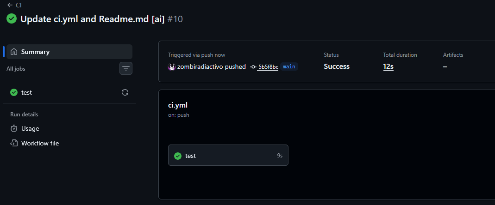

# StockGuard

Sistema de gestión de inventario desarrollado con buenas prácticas de código y seguridad.

[](https://github.com/zombiradiactivo/StockGuard/actions/workflows/ci.yml)



## Descripción

StockGuard es un sistema de gestión de inventario que permite:
- Agregar artículos con cantidad y precio validados
- Actualizar precios de artículos existentes
- Calcular el valor total del inventario
- Persistencia de datos en formato JSON

## Instalación

```bash
pip install -r requirements.txt
```

## Ejecutar Tests

```bash
pytest tests/ -v
```

## Uso

```python
from stockguard.models import Item
from stockguard.validator import validate_qty, validate_price
from stockguard.storage import load_inventory, save_inventory
```

## Uso de IA

Este proyecto fue generado y documentado con asistencia de IA:

| Archivo | Descripción |
|---------|-------------|
| `stockguard/models.py` | Dataclass `Item` con validación en `__post_init__` |
| `stockguard/validator.py` | Funciones `validate_qty()` y `validate_price()` |
| `stockguard/storage.py` | Carga/guardado con manejo de errores |
| `tests/test_*.py` | Tests unitarios con pytest |
| `.github/workflows/ci.yml` | Pipeline de CI/CD |
| `AUDIT.md` | Análisis de vulnerabilidades del código legacy |

### Captura del CLI

```
============================= test session starts =============================
tests/test_models.py::TestItem::test_creacion_valida PASSED[  3%]
tests/test_models.py::TestItem::test_valueerror_qty_cero PASSED[  6%]
tests/test_models.py::TestItem::test_valueerror_qty_negativo PASSED[ 10%]
tests/test_models.py::TestItem::test_valueerror_price_cero PASSED[ 13%]
tests/test_models.py::TestItem::test_valueerror_price_negativo PASSED[ 17%]
tests/test_models.py::TestItem::test_edge_case_precio_minimo PASSED[ 20%]
tests/test_models.py::TestItem::test_edge_case_qty_muy_grande PASSED[ 24%]
tests/test_storage.py::TestLoadInventory::test_archivo_inexistente PASSED[ 27%]
tests/test_storage.py::TestLoadInventory::test_archivo_corrupto PASSED[ 31%]
tests/test_storage.py::TestLoadInventory::test_archivo_vacio PASSED[ 34%]
tests/test_storage.py::TestLoadInventory::test_carga_exitosa PASSED[ 37%]
tests/test_storage.py::TestSaveInventory::test_guardado_con_indent_dos PASSED[ 41%]
tests/test_storage.py::TestSaveInventory::test_guardado_archivo_vacio PASSED[ 44%]
tests/test_validator.py::TestValidateQty::test_valido_positivo PASSED[ 48%]
tests/test_validator.py::TestValidateQty::test_limite_cero PASSED[ 51%]
tests/test_validator.py::TestValidateQty::test_negativo PASSED[ 55%]
tests/test_validator.py::TestValidateQty::test_mu_alto PASSED[ 58%]
tests/test_validator.py::TestValidateQty::test_tipo_invalido_string PASSED[ 62%]
tests/test_validator.py::TestValidateQty::test_tipo_invalido_float PASSED[ 65%]
tests/test_validator.py::TestValidateQty::test_edge_case_qty_max_int PASSED[ 68%]
tests/test_validator.py::TestValidateQty::test_edge_case_qty_negativo_gran_magnitud PASSED[ 72%]
tests/test_validator.py::TestValidatePrice::test_valido_positivo PASSED[ 75%]
tests/test_validator.py::TestValidatePrice::test_limite_cero PASSED[ 79%]
tests/test_validator.py::TestValidatePrice::test_negativo PASSED[ 82%]
tests/test_validator.py::TestValidatePrice::test_mu_alto PASSED[ 86%]
tests/test_validator.py::TestValidatePrice::test_tipo_invalido_string PASSED[ 89%]
tests/test_validator.py::TestValidatePrice::test_tipo_invalido_none PASSED[ 93%]
tests/test_validator.py::TestValidatePrice::test_edge_case_precio_minimo_valido PASSED[ 96%]
tests/test_validator.py::TestValidatePrice::test_edge_case_precio_float_negativo_exacto PASSED[100%]
============================== 29 passed in 0.15s ==============================
```
